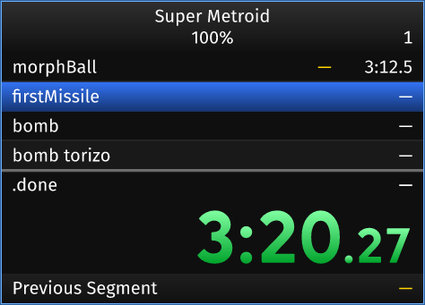

# About

This is a simple barebones re-imagining of LiveSplit + autosplitter for SNES
(sd2snes/fxpak). It's named for the [phylum of segmented
worms](https://en.wikipedia.org/wiki/Annelid), because segments (and maybe
because it's a bit ugly).

It currently only supports Super Metroid, but other SNES games could be easily
added. The Super Metroid support is based on
[SuperMetroid.asl](data/SuperMetroid.asl).

It's written in Rust using `egui`. This means it should work on Windows, macOS,
and Linux. However, I've only tested it on Linux.

# TODO

  * [ ] Settings editor. A tree view with checkboxes should work pretty well for
    configuring autosplit behavior.
  * [ ] Named settings that can be saved/loaded
  * [ ] Right-click menu for:
  *     - Settings editor
  *     - Save/Load splits and settings
  *     - Way to select your usb2snes server
  *     - Toggle for latency display
  * [ ] Keybindings for skipping a split, undo, pausing, and stopping. Whatever livesplit supports.
  * [ ] Make sure the logic for starting a new run starts from a fresh snes state
  * [ ] Implement comparisons
  * [ ] Fix the horizontal sizing, currently hard coded
  * [ ] Allow it to start up without a connection and stay running when the
  connection dies
